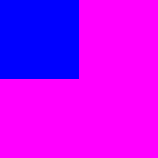
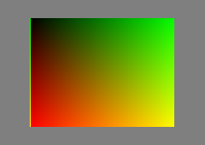
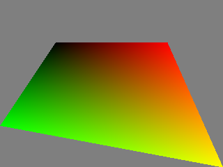
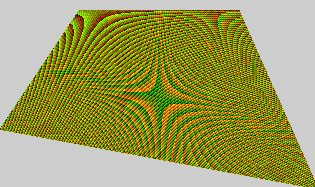

This log serves a purpose of reminding myself of some of the problems that I faced, frustrations that kept wake at night and how I handled/managed them. Log wasn't started immediately as the project did, but it's late a few days.

***Dec 3, 2015***
---

First rendered image.

I will also soon discuss some of the issues that I came along during the initial effort to build a pipeline, new realizations and problems that weren't initially planned. Yet, I'm pretty happy to see the thing displayed, even though it was a master cheat to get that image. Image is actually 10x10, there is practically no camera, no projection, no bound-split, not even a real dicing. No shaders. Only quarter of parallel quadrilateral (blue) is visible. I said it was a cheat. :D

So, v1.0 us out. I've modified goals in a readme.

***on inverse interpolation:*** While I was thinking about rasterization, I needed some way of getting interpolated attributes for a given point in space. So this is the problem: the primitive is ignorant of the rasterization that will happen on it. And the Image is responsible for generating samples (some Image might generate only one sample, while anti-aliased buffers will try to generate many samples). In conclusion, it is the Image that will generate sample points, and therefore I need some way of getting a color for a generated sample. So, I need piece of code that will input a Primitive (or the Shape that is made of bunch of Primitives) and a sample point (location), and the output would be a color of the Primitive at that location (interpolated value). I currently plan three basic Primitives: quadrilaterals, triangles and polygons. So for each of those, I need inverse interpolation function. [Shadertoy - quadrilateral interpolation](https://www.shadertoy.com/view/ldt3Wr) is the toy that I made, with my own version of the method (which is wrong and introduces UV seams), but later got corrected by Inigo Quilez how to do it properly. Entire code is on the Shadertoy. So, quadrilaterals are good. I also found [inverse barycentric](http://ofekshilon.com/2013/01/21/geometric-inverse-application-1-barycentric-coordinates/) article. I'll throw another Shadertoy example soon ([inverse barycentric](https://www.shadertoy.com/view/4d3GDH).

---

***on reyes:*** Figuring out the REYES was a fun ride. It took me a while to see what is the pipeline, what are the required functions, what are the pros and cons of the REYES over simple rasterization and pathtracing. So, where does reyes fit into rendering strategies?

REYES is rasterization algorithm. One things that is good at - adaptive tessellation. Like it's presented in the "reyes architecture and implementation" slides in the papers folder, the usual, uniform tessellation of the primitives often leads to problem of over-tessellation or under-tessellation (I have no idea if these are valid words). So REYES' pipeline is built on "screen-space tessellation". It bounds shape, approximates its dimensions, and splits if needed to reach a threshold. The goal of splitting to some threshold is to be memory-friendly, mostly. Eventually, the shape will be diced, i.e. cut, into small, tiny, tiny chunks, called micropolygons. Micropolygons are polygons that are around or under 1px size (area or diameter). Dicing entire shape into micropolygons without bound-split would leave us with massive amounts of micropolygons in memory. Also, dicing the shape into bunch of micropoygons is like super highres uniform tessellation, and we already concluded that's not always the best way to go about rendering. So bound-split servers a purpose of adaptive tessellation estimation, and dicing is there to actually tessellate the final, split parts of the shape.

So, bound-split and dicing, all good. We've adaptively tessellated our shape by splitting it into smaller parts of it, and then we uniformly tessellated those parts. What's left are microgrids of micropolygons.

Next step is shading. Micrpolygons are so small, that they are 1px in size, they are like fragments (from fragments shader). We can shade. Just points inside the microgrid, and interpolate colors across the micropolygon.

Final step is sampling, aka rasterization. It is very much like traditional rasterization where pipeline would generate sampling points, the primitives (micropolygons) are sampled at those points and everything is accumulated in the color buffer.

One neat things is bucketing. We can subdivide screen into smaller regions and go through them independently. On the slides previously mentioned, they also mention that storing microgrids is not very memory-efficient neither is holding entire color buffer. So we can just do things in chunks, which is good.

***Dec 5, 2015***
---

***intro Catmull-Clark:*** Started looking into additional surfaces, just thinking about them, and how would I later maybe implement them. More specifically, Catmull-Clark subdivision surfaces. Their algorithm is very simple and straight-forward and can be found on [Wikipedia](https://en.wikipedia.org/wiki/Catmull%E2%80%93Clark_subdivision_surface). These surfaces, by my understanding are used to just coarsely define the geometry, but then can refined as much as we want. They are procedural surfaces, in a way that they do not have finite resolution, but are represented through a few parameters (control points, i.e. faces and vertices). I am neither familiar with the math involved, all the magic numbers and reasons why things work the way they work, nor other similar parametric surfaces like NURBS, Bezier surfaces... I also don't quite understand advantages of one surface representation over another, problems that it might have and any additional mathematical pro/con (derivatives for example etc). I have basic understanding of those, but I am nowhere near expert so I guess I'd just have to take things for granted for now. Even so, they fir nicely with reyes' pipeline. I can imagine taking a Catmull-Clark surface, splitting it and refining until reaching a subpixel size for the primitives. I've created a separate repo for Catmull-Clark tests, but I'll try and integrate them into reyes' asap.

***reyes caveats:*** cracks, displacement caution while bound-split phase, non-proportional micropolygons, parallel execution of stages (good read at [papers/parallel_upoly_rendering.pdf](../papers/parallel_upoly_rendering.pdf))

***Dec 9, 2015***
---

***pixel cracks***: while I was trying out rasterizer and playing with UVs and quads, I noticed these cracks:

It didn't seem logical at all, it was rare. But I noticed it's always edge pixels, and those that are extremely close to not being rasterized at all. I remembered to add a half-pixel offset, so I actually end up checking for center of the pixel instead of it's top-left corner. That was a quick fix. Then I renderer a rectangle and got this:

It seems like UV wrapped around. So I <i>really carefully</i> adjusted those half-pixel offsets (X and Y offsets have different sings because axes grow in different directions when compared to screen axes). Note to myself: be careful.

After all the hassle, here's the pixel-cracks-free and the-right-UV-mapped quadrilateral. :)

---

interesting but wrong #1

interesting but wrong #2 (there's an arc in the intersection between two planar shapes)

